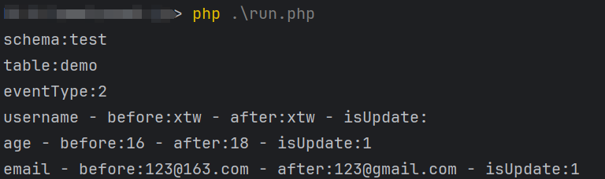
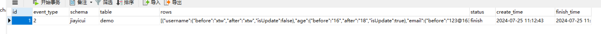

# canal-php-framework

## 一.canal-php-framework 简介

canal-php-framework 基于canal-php开发，使开发者不需要关心通信，数据解析，聚焦于业务逻辑

canal-php 是阿里巴巴开源项目 [Canal](https://github.com/alibaba/canal)是阿里巴巴mysql数据库binlog的增量订阅&消费组件 的 php 客户端。为 php 开发者提供一个更友好的使用 Canal 的方式。Canal 是mysql数据库binlog的增量订阅&消费组件。

基于日志增量订阅&消费支持的业务：

1. 数据库镜像
2. 数据库实时备份
3. 多级索引 (卖家和买家各自分库索引)
4. search build
5. 业务cache刷新
6. 价格变化等重要业务消息


### 使用前提

必须了解Canal服务端搭建。Canal服务端文档： https://github.com/alibaba/canal/wiki


## 二.应用场景

canal-php 作为Canal的客户端，其应用场景就是Canal的应用场景。关于应用场景在Canal介绍一节已有概述。举一些实际的使用例子：

1.代替使用轮询数据库方式来监控数据库变更，有效改善轮询耗费数据库资源。

2.根据数据库的变更实时更新搜索引擎，比如电商场景下商品信息发生变更，实时同步到商品搜索引擎 Elasticsearch、solr等

3.根据数据库的变更实时更新缓存，比如电商场景下商品价格、库存发生变更实时同步到redis

4.数据库异地备份、数据同步

5.根据数据库变更触发某种业务，比如电商场景下，创建订单超过xx时间未支付被自动取消，我们获取到这条订单数据的状态变更即可向用户推送消息。

6.将数据库变更整理成自己的数据格式发送到kafka等消息队列，供消息队列的消费者进行消费。

## 三.工作原理

canal-php  是 Canal 的 php 客户端，它与 Canal 是采用的Socket来进行通信的，传输协议是TCP，交互协议采用的是 Google Protocol Buffer 3.0。

## 四.工作流程

1.Canal连接到mysql数据库，模拟slave

2.canal-php 与 Canal 建立连接

3.数据库发生变更写入到binlog

4.Canal向数据库发送dump请求，获取binlog并解析

5.canal-php 向 Canal 请求数据库变更

6.Canal 发送解析后的数据给canal-php

7.canal-php收到数据，消费成功，发送回执。（可选）

8.Canal记录消费位置。

## 五.快速启动

### 安装Canal

Canal 的安装以及配置使用请查看 https://github.com/alibaba/canal/wiki/QuickStart


### 构建canal-php-framework客户端

````shell
$ cd canal-php-framework
$ composer install
````

### 复制.env.example为 .env 并修改参数
````
[CANAL]
HOST=Canal服务器的ip  例如：127.0.0.1
PORT=Canal服务器的端口 例如：11111
FILTER=.*\\..* 要监听的表的正则匹配

[DB] 
HOST=127.0.0.1  canal-php-framework要操作的数据库连接
PORT=3306
DB_NAME=test
USER=root
PASSWORD=root
````

### 创建log表：运行log.sql
```
CREATE TABLE `canal_change_log` (
    `id` int(10) unsigned NOT NULL AUTO_INCREMENT,
    `schema` varchar(64) NOT NULL DEFAULT '',
    `table` varchar(64) NOT NULL DEFAULT '',
    `rows` text DEFAULT NULL,
    `status` varchar(32) NOT NULL DEFAULT '',
    `event_type` varchar(10) NOT NULL DEFAULT '',
    `create_time` datetime DEFAULT NULL,
    `finish_time` datetime DEFAULT NULL,
    PRIMARY KEY (`id`)
) ENGINE=InnoDB DEFAULT CHARSET=utf8mb4;
```

### 创建test库，并在test库下创建demo表
```
CREATE DATABASE test;

CREATE TABLE test.demo (
  username VARCHAR(255),
  age INT,
  email VARCHAR(255)
);
```

### 启动canal-php-framework
```
php run.php
```

### 改变demo表的的记录 查看效果
#### 控制台输出：


#### log表记录：


### 六.如何扩展
1.在app\logic目录下创建目录(必须和数据库名一致)

2.在app\logic\{database}\下创建类(大驼峰，必须和表名一致，若表名为canal_demo,则类名为CanalDemo)

3.实现类中的handle方法
```php
<?php

namespace app\logic\test;

use core\lib\LogicAbstract;

class Demo extends LogicAbstract
{

    public function handle(): bool
    {
        print_r('schema:' . $this->change->getSchema() . "\n");
        print_r('table:' . $this->change->getTable() . "\n");
        print_r('eventType:' . $this->change->getEventType() . "\n");
        foreach ($this->change->getRows() as $row) {
            foreach ($row as $key => $value) {
                echo "{$key} - before:{$value['before']} - after:{$value['after']} - isUpdate:{$value['isUpdate']}\n";
            }
        }

        return true;
    }

}
```

## 七.操作数据库
1.数据库采用medoo 文档：https://medoo.lvtao.net/1.2/doc.php

```php
// 一定要使用Db::instance()获取Medoo对象，否则没有断线重连机制
Db::instance()->insert('xxxxxx',[
   'xxxxx' => 1,
]);

// 切换连接
Db::instance()->link('test')->insert('xxxxxx',[
   'xxxxx' => 1,
]);
```

## 八.日志、配置
```php
// 记录日志
Log::info("info");
Log::error("error");
Log::debug("debug");
Log::notice("notice");
... ...

// 获取app/config目录下的配置值 有以下两种方式
Config::instance()->get('canal.host');
config('app.host');

// 获取env下的配置文件 有以下两种方式
Env::instance()->get('DB_HOST');
env('DB_HOST');
```